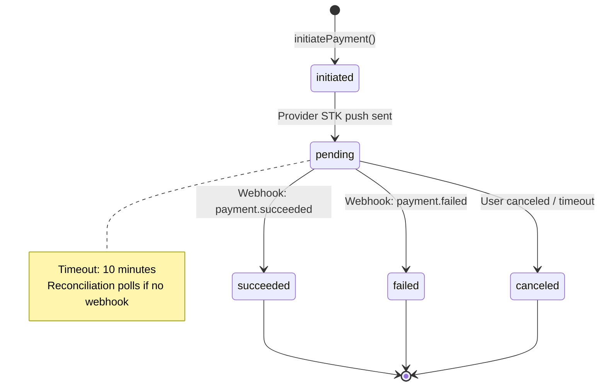

# ADR-0002: Payment Orchestrator Abstraction Layer

**Status**: Accepted
**Date**: 2025-11-19
**Deciders**: Architect Agent
**Tags**: [architecture, backend, payments, mobile-money]

## Context and Problem Statement

Aria must support multiple mobile money providers (Orange Money, Wave) at MVP launch, with future expansion to MTN MoMo, Stripe cards, and potentially other payment rails. Each provider has distinct APIs, webhook formats, authentication mechanisms, and operational characteristics. Without abstraction, payment logic would be duplicated and tightly coupled to specific providers, making it difficult to:

- Add new payment providers without modifying core checkout logic
- Handle provider-specific webhook formats and retry behaviors
- Implement consistent idempotency, reconciliation, and anti-fraud measures
- Test payment flows in isolation with mocks or sandboxes

**Referenced sections**: DESIGN.md Section 7 (Payments Orchestrator), Section 6 (State Machines)

## Decision Drivers

- **Provider diversity**: Need to support 2+ mobile money providers at MVP, with roadmap for 5+ payment rails
- **Reliability**: Payment success rate must exceed 95%; webhook handling must be idempotent and replay-safe
- **Regional constraints**: Mobile money APIs have varying maturity (some lack webhooks, require polling, or have delayed callbacks)
- **Reconciliation**: Must match provider settlement files to internal payment records daily
- **Performance**: Payment initiation must complete in <3s P95 on mobile networks
- **Maintainability**: New engineers should be able to add a provider without touching core domain logic

## Considered Options

### Option A: Direct Provider Integration (No Abstraction)
Embed provider-specific code directly in `OrderController` and `WebhookController`; use conditional logic to route by provider.

**Pros**:
- Simple initial implementation
- No extra abstractions to learn

**Cons**:
- Violates Open/Closed Principle; adding providers requires modifying core logic
- Difficult to test without hitting real provider APIs
- Webhook handling logic duplicated per provider
- Reconciliation logic becomes a giant switch statement

### Option B: Strategy Pattern with PaymentProvider Interface
Define a `PaymentProvider` interface with concrete implementations per provider (`OrangeMoneyProvider`, `WaveProvider`, etc.). Use Laravel's service container for dependency injection.

**Pros**:
- Clean separation of concerns; provider logic encapsulated
- Easy to mock for testing (inject `FakeProvider` in tests)
- New providers added without modifying existing code
- Shared webhook validation and idempotency logic in base class

**Cons**:
- Requires initial architectural investment
- Developers must understand interface contracts

### Option C: Third-Party Payment Gateway Abstraction (e.g., Flutterwave Rave, Paystack)
Use a regional payment aggregator that supports multiple providers behind a single API.

**Pros**:
- Offloads provider integration complexity
- Faster time-to-market for MVP

**Cons**:
- Adds third-party dependency and additional fees (2-3% on top of provider fees)
- Limited control over provider selection and negotiation
- Vendor lock-in risk; migration would require rewriting payment logic
- Not all West African mobile money providers supported

## Decision Outcome

**Chosen option**: Option B - Strategy Pattern with PaymentProvider Interface

**Justification**: While Option C reduces initial complexity, the additional fees (2-3%) on our target 5% platform fee would significantly erode margins. Given that mobile money APIs are RESTful and well-documented (Orange Money and Wave both provide SDKs), the implementation complexity is manageable. Option B gives us full control over provider relationships, fee negotiation, and reconciliation processes while maintaining clean architecture.

## Implementation Details

### PaymentProvider Interface

```php
<?php

namespace App\Contracts\Payments;

use App\Models\Order;
use App\Models\Payment;

interface PaymentProvider
{
    /**
     * Initiate payment collection from customer.
     *
     * @param Order $order
     * @param string $msisdn E.164 formatted phone number
     * @param string $idempotencyKey Unique key for this payment attempt
     * @return PaymentResponse
     * @throws PaymentException
     */
    public function initiatePayment(Order $order, string $msisdn, string $idempotencyKey): PaymentResponse;

    /**
     * Verify webhook signature and parse payload.
     *
     * @param array $headers HTTP headers from webhook request
     * @param string $rawBody Raw request body for signature verification
     * @return WebhookResult
     * @throws InvalidSignatureException
     */
    public function handleWebhook(array $headers, string $rawBody): WebhookResult;

    /**
     * Poll payment status (for providers without webhooks).
     *
     * @param Payment $payment
     * @return PaymentStatusResponse
     */
    public function pollPaymentStatus(Payment $payment): PaymentStatusResponse;

    /**
     * Initiate payout to organizer.
     *
     * @param Payout $payout
     * @param string $destination MSISDN or account identifier
     * @return PayoutResponse
     * @throws PayoutException
     */
    public function initiatePayout(Payout $payout, string $destination): PayoutResponse;

    /**
     * Get provider's fee structure for amount calculation.
     *
     * @param int $amountXof Amount in XOF minor units
     * @return FeeStructure
     */
    public function getFeeStructure(int $amountXof): FeeStructure;

    /**
     * Reconcile provider settlement file with internal records.
     *
     * @param string $settlementFilePath Path to imported settlement CSV/JSON
     * @return ReconciliationReport
     */
    public function reconcileSettlement(string $settlementFilePath): ReconciliationReport;
}
```

### Value Objects

```php
<?php

namespace App\DataTransferObjects\Payments;

class PaymentResponse
{
    public function __construct(
        public readonly string $providerRef,      // Provider's transaction ID
        public readonly PaymentStatus $status,     // initiated|pending|succeeded|failed
        public readonly ?string $redirectUrl,      // For USSD/webview flows
        public readonly ?string $ussdCode,         // For USSD dial strings
        public readonly array $metadata,           // Provider-specific data
    ) {}
}

class WebhookResult
{
    public function __construct(
        public readonly string $providerRef,
        public readonly PaymentStatus $status,
        public readonly int $amountXof,
        public readonly string $orderId,
        public readonly \DateTimeImmutable $timestamp,
        public readonly array $rawPayload,        // Store for audit
    ) {}
}

enum PaymentStatus: string
{
    case INITIATED = 'initiated';
    case PENDING = 'pending';
    case SUCCEEDED = 'succeeded';
    case FAILED = 'failed';
    case CANCELED = 'canceled';
}
```

### Orange Money Provider Implementation (Example)

```php
<?php

namespace App\Services\Payments\Providers;

use App\Contracts\Payments\PaymentProvider;
use Illuminate\Support\Facades\Http;

class OrangeMoneyProvider implements PaymentProvider
{
    private const API_BASE = 'https://api.orange.com/orange-money-webpay/ci/v1';
    private const WEBHOOK_SECRET_KEY = 'ORANGE_WEBHOOK_SECRET';

    public function __construct(
        private readonly string $merchantId,
        private readonly string $apiKey,
        private readonly string $webhookSecret,
    ) {}

    public function initiatePayment(Order $order, string $msisdn, string $idempotencyKey): PaymentResponse
    {
        $response = Http::withHeaders([
            'Authorization' => "Bearer {$this->getAccessToken()}",
            'X-Idempotency-Key' => $idempotencyKey,
        ])->post(self::API_BASE . '/payments', [
            'amount' => $order->amount_total,
            'currency' => 'XOF',
            'order_id' => $order->id,
            'customer_msisdn' => $msisdn,
            'return_url' => route('checkout.callback', $order->id),
            'webhook_url' => route('webhooks.payments.orange-money'),
        ]);

        if ($response->failed()) {
            throw new PaymentException("Orange Money API error: " . $response->body());
        }

        $data = $response->json();

        return new PaymentResponse(
            providerRef: $data['pay_token'],
            status: PaymentStatus::INITIATED,
            redirectUrl: $data['payment_url'] ?? null,
            ussdCode: null,
            metadata: ['notif_token' => $data['notif_token'] ?? null],
        );
    }

    public function handleWebhook(array $headers, string $rawBody): WebhookResult
    {
        // Verify HMAC signature
        $expectedSignature = hash_hmac('sha256', $rawBody, $this->webhookSecret);
        $receivedSignature = $headers['X-Orange-Signature'] ?? '';

        if (!hash_equals($expectedSignature, $receivedSignature)) {
            throw new InvalidSignatureException('Invalid Orange Money webhook signature');
        }

        $payload = json_decode($rawBody, true);

        // Replay protection: verify timestamp within 5 minutes
        $timestamp = new \DateTimeImmutable('@' . $payload['timestamp']);
        if ($timestamp < now()->subMinutes(5)) {
            throw new ReplayAttackException('Webhook timestamp too old');
        }

        return new WebhookResult(
            providerRef: $payload['pay_token'],
            status: $this->mapOrangeStatus($payload['status']),
            amountXof: (int) $payload['amount'],
            orderId: $payload['order_id'],
            timestamp: $timestamp,
            rawPayload: $payload,
        );
    }

    private function mapOrangeStatus(string $orangeStatus): PaymentStatus
    {
        return match ($orangeStatus) {
            'INITIATED' => PaymentStatus::INITIATED,
            'PENDING' => PaymentStatus::PENDING,
            'SUCCESS' => PaymentStatus::SUCCEEDED,
            'FAILED', 'EXPIRED' => PaymentStatus::FAILED,
            default => throw new \InvalidArgumentException("Unknown Orange status: $orangeStatus"),
        };
    }

    // ... other methods (pollPaymentStatus, initiatePayout, getFeeStructure, reconcileSettlement)
}
```

### Webhook Controller

```php
<?php

namespace App\Http\Controllers\Api;

use App\Contracts\Payments\PaymentProvider;
use App\Jobs\ProcessPaymentWebhook;
use Illuminate\Http\Request;

class WebhookController extends Controller
{
    public function handlePayment(Request $request, string $provider)
    {
        // Resolve provider from container
        $providerInstance = app()->make("payment.provider.{$provider}");

        // Verify signature and parse webhook (synchronous)
        try {
            $webhookResult = $providerInstance->handleWebhook(
                $request->headers->all(),
                $request->getContent()
            );
        } catch (InvalidSignatureException $e) {
            report($e);
            return response()->json(['error' => 'Invalid signature'], 401);
        }

        // Dispatch async job to process payment (idempotent)
        ProcessPaymentWebhook::dispatch($provider, $webhookResult);

        // Respond immediately (providers expect 200 within 5s)
        return response()->json(['status' => 'accepted'], 200);
    }
}
```

### State Machine Diagram



### Idempotency Implementation

```php
<?php

namespace App\Services;

use App\Models\Order;
use App\Models\Payment;
use Illuminate\Support\Facades\DB;

class PaymentService
{
    public function initiatePayment(Order $order, string $provider, string $msisdn): Payment
    {
        // Use order's idempotency key to prevent duplicate payment attempts
        $idempotencyKey = $order->idempotency_key;

        return DB::transaction(function () use ($order, $provider, $msisdn, $idempotencyKey) {
            // Check for existing payment with same idempotency key
            $existing = Payment::where('idempotency_key', $idempotencyKey)->first();
            if ($existing) {
                return $existing; // Return existing payment (idempotent)
            }

            $providerInstance = app()->make("payment.provider.{$provider}");
            $response = $providerInstance->initiatePayment($order, $msisdn, $idempotencyKey);

            // Create payment record
            return Payment::create([
                'id' => Str::uuid(),
                'order_id' => $order->id,
                'provider' => $provider,
                'provider_ref' => $response->providerRef,
                'state' => $response->status->value,
                'request_payload' => [
                    'msisdn' => $msisdn,
                    'amount' => $order->amount_total,
                ],
                'idempotency_key' => $idempotencyKey,
            ]);
        });
    }
}
```

### Reconciliation Strategy

**Daily Reconciliation Job**:
```php
<?php

namespace App\Jobs;

use App\Models\Payment;
use Illuminate\Support\Facades\Storage;

class ReconcileProviderSettlement extends Job
{
    public function handle(string $provider)
    {
        // Download settlement file from provider SFTP or API
        $settlementFile = Storage::disk('reconciliation')->get("{$provider}/settlement-" . now()->format('Y-m-d') . ".csv");

        $providerInstance = app()->make("payment.provider.{$provider}");
        $report = $providerInstance->reconcileSettlement($settlementFile);

        // Flag mismatches
        foreach ($report->unmatchedPayments as $providerRef) {
            $payment = Payment::where('provider_ref', $providerRef)->first();
            if ($payment && $payment->state === 'pending') {
                // Poll status or mark for manual review
                $status = $providerInstance->pollPaymentStatus($payment);
                $payment->update(['state' => $status->state]);
            }
        }

        // Alert if mismatch rate > 1%
        if ($report->mismatchRate > 0.01) {
            \Notification::route('slack', config('slack.alerts_channel'))
                ->notify(new ReconciliationAlertNotification($provider, $report));
        }
    }
}
```

## Consequences

### Positive
- **Extensibility**: New providers added by implementing interface without modifying core logic
- **Testability**: Can inject `FakePaymentProvider` in tests for fast, deterministic test suites
- **Maintainability**: Provider-specific quirks isolated; webhook logic standardized
- **Observability**: Common instrumentation points in interface (all providers emit same metrics)
- **Reliability**: Shared idempotency and retry logic reduces duplicate payment risk

### Negative
- **Initial complexity**: Requires upfront design and interface definition
- **Learning curve**: New developers must understand abstraction layer before adding providers
- **Overhead**: Extra classes/files compared to direct integration

### Risks and Mitigations

**Risk**: Provider API changes break production
**Mitigation**: Contract tests against provider sandboxes; versioned API clients; provider health checks in CI

**Risk**: Webhook delays cause UX degradation (user sees "pending" for minutes)
**Mitigation**: Polling fallback job runs every 30s for pending payments; show clear messaging "Payment processing, check SMS"

**Risk**: Reconciliation mismatches due to clock skew or currency rounding
**Mitigation**: Store timestamps in UTC with nanosecond precision; use provider's settlement amounts as source of truth

## References
- DESIGN.md Section 7: Payments Orchestrator
- DESIGN.md Section 6: State Machines (Payment)
- Product Spec: aria-mvp.md User Story 5 (System processes mobile-money payment)
- External: [Orange Money API Docs](https://developer.orange.com/apis/orange-money-webpay/), [Wave API Docs](https://developer.wave.com/)
