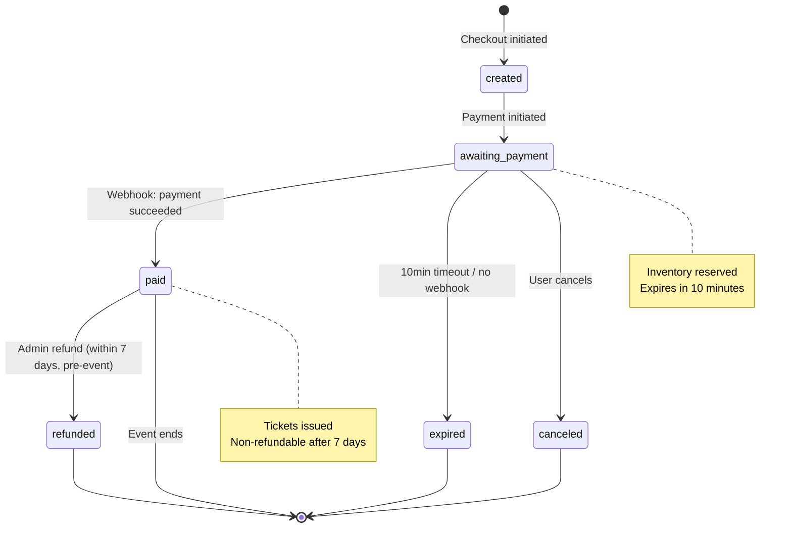
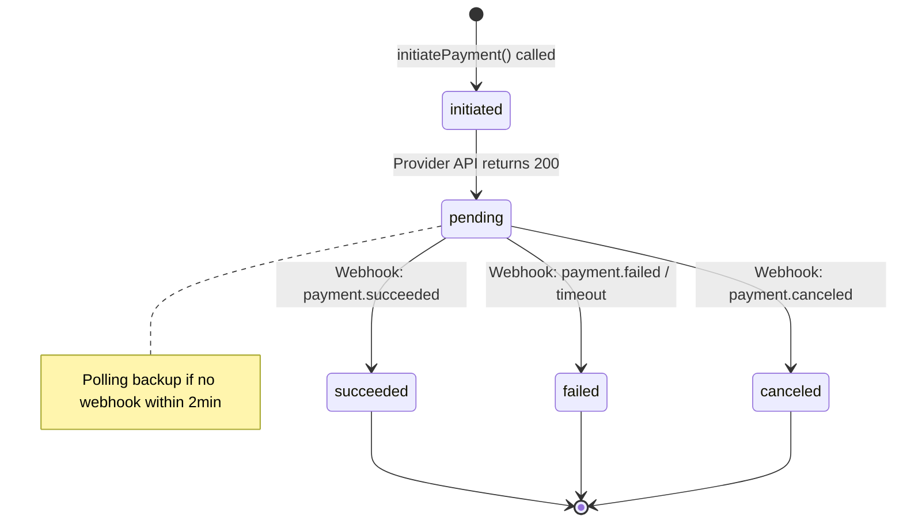
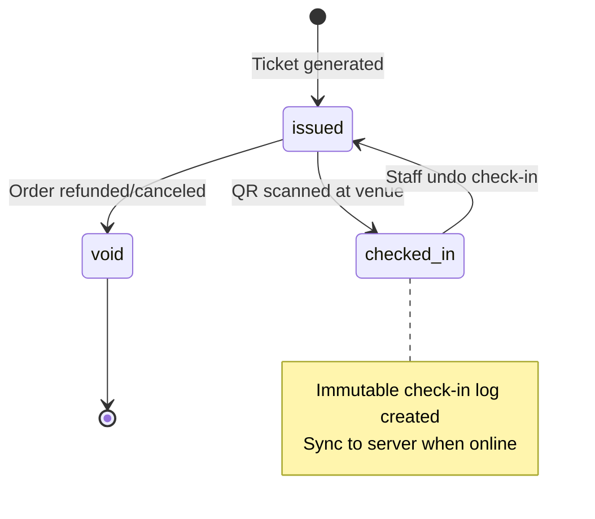

# ADR-0005: State Machines for Orders, Payments, and Tickets

**Status**: Accepted
**Date**: 2025-11-19
**Deciders**: Architect Agent
**Tags**: [architecture, backend, domain-logic, state-management]

## Context and Problem Statement

Aria's core entities (Orders, Payments, Tickets) undergo complex state transitions driven by user actions, external webhooks (payment providers), and background jobs (expiry sweepers). Without explicit state machines, we risk:

- **Invalid transitions**: e.g., transitioning from `paid` to `awaiting_payment` (should be impossible)
- **Race conditions**: e.g., webhook arriving while order is being canceled manually
- **Audit gaps**: e.g., unable to answer "why did this order get refunded?"
- **Business logic leaks**: e.g., state transition logic scattered across controllers, jobs, and event listeners

We need a formal state machine implementation that:
- Enforces valid transitions with guards (e.g., "can only refund if paid within 7 days")
- Provides audit logging for every state change (who, when, why)
- Supports side effects (e.g., releasing inventory on expiry, dispatching tickets on payment success)
- Is testable in isolation without hitting database or external APIs

**Referenced sections**: DESIGN.md Section 6 (State Machines)

## Decision Drivers

- **Correctness**: Prevent invalid state transitions that could cause data corruption
- **Auditability**: Compliance requires knowing exact timestamp and reason for every state change
- **Concurrency**: Multiple processes (webhook receivers, cron jobs, user actions) may attempt transitions simultaneously
- **Testability**: Unit test state transitions without database or external dependencies
- **Maintainability**: Business logic centralized in state machine definitions, not scattered across codebase
- **Performance**: State transitions must complete in <50ms (no blocking external calls)

## Considered Options

### Option A: Status Column Only (No Formal State Machine)
Store `state` as an enum column; update it directly in controllers and jobs.

**Pros**:
- Simplest implementation (no library dependencies)
- Minimal learning curve

**Cons**:
- No enforcement of valid transitions (developers can set any state)
- Difficult to add guards (e.g., "can only refund within 7 days")
- Side effects scattered across codebase (hard to trace)
- No automatic audit logging

### Option B: Laravel State Machine Package (spatie/laravel-model-states)
Use Spatie's state machine library for Eloquent models.

**Pros**:
- Declarative state definitions in PHP classes
- Built-in transition guards and callbacks
- Automatic audit logging via package hooks
- Battle-tested in production Laravel apps

**Cons**:
- Package dependency (minimal risk; Spatie is well-maintained)
- Requires understanding package conventions

### Option C: Custom State Machine Implementation
Build bespoke state machine engine tailored to Aria's needs.

**Pros**:
- Full control over API and behavior
- No external dependencies

**Cons**:
- High development cost (weeks of work)
- Likely reinvents existing solutions poorly
- Increased maintenance burden

### Option D: Event Sourcing (Store Events, Derive State)
Store immutable events (e.g., `OrderCreated`, `PaymentSucceeded`); recompute state from event log.

**Pros**:
- Complete audit trail (every state change is an event)
- Can replay events to debug issues
- Enables advanced analytics (event stream processing)

**Cons**:
- Significant architectural complexity (event store, projections, eventual consistency)
- Overkill for MVP (premature optimization)
- Harder to query current state (requires projection)

## Decision Outcome

**Chosen option**: Option B - Laravel State Machine Package (spatie/laravel-model-states)

**Justification**: Spatie's package provides the right balance of simplicity and power. It enforces valid transitions, supports guards, and integrates seamlessly with Eloquent models. Audit logging can be added via package hooks or database triggers. Event sourcing (Option D) is deferred to post-MVP if analytics or regulatory requirements demand it.

## Implementation Details

### Installation

```bash
composer require spatie/laravel-model-states
```

### Order State Machine

**States**:
- `created`: Order reserved, inventory held, awaiting payment initiation
- `awaiting_payment`: Payment initiated (STK push sent), waiting for webhook
- `paid`: Payment succeeded, tickets issued
- `expired`: Payment timeout (10 minutes), inventory released
- `canceled`: Manually canceled by user or admin
- `refunded`: Payment refunded, tickets voided

```php
<?php

namespace App\States\Order;

use Spatie\ModelStates\State;
use Spatie\ModelStates\StateConfig;

abstract class OrderState extends State
{
    abstract public function canTransitionTo(OrderState $targetState): bool;

    public static function config(): StateConfig
    {
        return parent::config()
            ->default(CreatedState::class)
            ->allowTransition(CreatedState::class, AwaitingPaymentState::class)
            ->allowTransition(AwaitingPaymentState::class, PaidState::class)
            ->allowTransition(AwaitingPaymentState::class, ExpiredState::class)
            ->allowTransition(AwaitingPaymentState::class, CanceledState::class)
            ->allowTransition(PaidState::class, RefundedState::class);
    }
}

class CreatedState extends OrderState
{
    public function canTransitionTo(OrderState $targetState): bool
    {
        return $targetState instanceof AwaitingPaymentState;
    }
}

class AwaitingPaymentState extends OrderState
{
    public function canTransitionTo(OrderState $targetState): bool
    {
        return $targetState instanceof PaidState
            || $targetState instanceof ExpiredState
            || $targetState instanceof CanceledState;
    }
}

class PaidState extends OrderState
{
    public function canTransitionTo(OrderState $targetState): bool
    {
        // Can only refund if within 7 days and event hasn't started
        if ($targetState instanceof RefundedState) {
            return $this->order->created_at->diffInDays(now()) <= 7
                && $this->order->event->start_at->isFuture();
        }
        return false;
    }
}

class ExpiredState extends OrderState
{
    public function canTransitionTo(OrderState $targetState): bool
    {
        return false;  // Terminal state
    }
}

class CanceledState extends OrderState
{
    public function canTransitionTo(OrderState $targetState): bool
    {
        return false;  // Terminal state
    }
}

class RefundedState extends OrderState
{
    public function canTransitionTo(OrderState $targetState): bool
    {
        return false;  // Terminal state
    }
}
```

**Order Model**:

```php
<?php

namespace App\Models;

use App\States\Order\OrderState;
use Spatie\ModelStates\HasStates;
use Illuminate\Database\Eloquent\Model;

class Order extends Model
{
    use HasStates;

    protected $fillable = [
        'event_id', 'buyer_user_id', 'email', 'phone',
        'amount_subtotal', 'amount_fees', 'amount_total',
        'state', 'expires_at', 'idempotency_key',
    ];

    protected $casts = [
        'state' => OrderState::class,
        'expires_at' => 'datetime',
        'amount_subtotal' => 'decimal:2',
        'amount_total' => 'decimal:2',
    ];

    public function transitionTo(OrderState $state, string $reason = null): void
    {
        $oldState = $this->state;

        // Validate transition
        if (!$this->state->canTransitionTo($state)) {
            throw new InvalidTransitionException(
                "Cannot transition from {$oldState} to {$state}"
            );
        }

        // Perform transition
        $this->state = $state;
        $this->save();

        // Audit log
        \App\Models\AuditLog::create([
            'entity_type' => 'order',
            'entity_id' => $this->id,
            'action' => 'state_transition',
            'old_state' => ['state' => $oldState],
            'new_state' => ['state' => $state],
            'reason' => $reason,
            'actor_user_id' => auth()->id(),
        ]);

        // Side effects
        $this->executeTransitionSideEffects($oldState, $state);
    }

    private function executeTransitionSideEffects(OrderState $from, OrderState $to): void
    {
        // Release inventory on expiry or cancellation
        if ($to instanceof ExpiredState || $to instanceof CanceledState) {
            $this->releaseInventory();
        }

        // Issue tickets on payment success
        if ($to instanceof PaidState) {
            \App\Jobs\GenerateTickets::dispatch($this);
        }

        // Void tickets on refund
        if ($to instanceof RefundedState) {
            $this->tickets()->update(['state' => 'void']);
        }
    }

    private function releaseInventory(): void
    {
        foreach ($this->items as $item) {
            $item->ticketType->decrement('reserved_count', $item->qty);
        }
    }
}
```

### Order State Diagram



### Payment State Machine

**States**:
- `initiated`: Payment request sent to provider (STK push triggered)
- `pending`: Provider acknowledged, awaiting user confirmation
- `succeeded`: Payment confirmed by provider webhook
- `failed`: Payment declined (insufficient funds, canceled, timeout)
- `canceled`: User explicitly canceled payment

```php
<?php

namespace App\States\Payment;

use Spatie\ModelStates\State;
use Spatie\ModelStates\StateConfig;

abstract class PaymentState extends State
{
    public static function config(): StateConfig
    {
        return parent::config()
            ->default(InitiatedState::class)
            ->allowTransition(InitiatedState::class, PendingState::class)
            ->allowTransition(PendingState::class, SucceededState::class)
            ->allowTransition(PendingState::class, FailedState::class)
            ->allowTransition(PendingState::class, CanceledState::class);
    }
}

class InitiatedState extends PaymentState {}
class PendingState extends PaymentState {}
class SucceededState extends PaymentState {}
class FailedState extends PaymentState {}
class CanceledState extends PaymentState {}
```

**Payment Model**:

```php
<?php

namespace App\Models;

use App\States\Payment\PaymentState;
use Spatie\ModelStates\HasStates;
use Illuminate\Database\Eloquent\Model;

class Payment extends Model
{
    use HasStates;

    protected $casts = [
        'state' => PaymentState::class,
        'request_payload' => 'array',
        'webhook_payload' => 'array',
    ];

    public function transitionTo(PaymentState $state, array $webhookPayload = null): void
    {
        $oldState = $this->state;
        $this->state = $state;

        if ($webhookPayload) {
            $this->webhook_payload = $webhookPayload;
        }

        $this->save();

        // Audit log
        \App\Models\AuditLog::create([
            'entity_type' => 'payment',
            'entity_id' => $this->id,
            'action' => 'state_transition',
            'old_state' => ['state' => $oldState],
            'new_state' => ['state' => $state, 'webhook' => $webhookPayload],
        ]);

        // Side effect: update order state
        if ($state instanceof \App\States\Payment\SucceededState) {
            $this->order->transitionTo(new \App\States\Order\PaidState($this->order), 'Payment succeeded');
        } elseif ($state instanceof \App\States\Payment\FailedState) {
            // Optionally retry or notify user
            \Notification::route('mail', $this->order->email)
                ->notify(new \App\Notifications\PaymentFailedNotification($this->order));
        }
    }
}
```

### Payment State Diagram



### Ticket State Machine

**States**:
- `issued`: Ticket generated and sent to attendee
- `checked_in`: Ticket scanned at venue
- `void`: Ticket invalidated (refund, order canceled)

```php
<?php

namespace App\States\Ticket;

use Spatie\ModelStates\State;
use Spatie\ModelStates\StateConfig;

abstract class TicketState extends State
{
    public static function config(): StateConfig
    {
        return parent::config()
            ->default(IssuedState::class)
            ->allowTransition(IssuedState::class, CheckedInState::class)
            ->allowTransition(IssuedState::class, VoidState::class)
            ->allowTransition(CheckedInState::class, IssuedState::class);  // Undo check-in
    }
}

class IssuedState extends TicketState {}
class CheckedInState extends TicketState {}
class VoidState extends TicketState {}
```

**Ticket Model**:

```php
<?php

namespace App\Models;

use App\States\Ticket\TicketState;
use Spatie\ModelStates\HasStates;
use Illuminate\Database\Eloquent\Model;

class Ticket extends Model
{
    use HasStates;

    protected $casts = [
        'state' => TicketState::class,
    ];

    public function checkIn(string $deviceId, ?User $staff = null): void
    {
        if (!$this->state instanceof \App\States\Ticket\IssuedState) {
            throw new \Exception('Ticket already checked in or void');
        }

        $this->transitionTo(new \App\States\Ticket\CheckedInState($this));

        // Log check-in (immutable audit trail)
        \App\Models\CheckinLog::create([
            'event_id' => $this->order->event_id,
            'ticket_id' => $this->id,
            'staff_user_id' => $staff?->id,
            'action' => 'check_in',
            'device_id' => $deviceId,
            'occurred_at' => now(),
        ]);
    }

    public function undoCheckIn(string $deviceId, ?User $staff = null): void
    {
        if (!$this->state instanceof \App\States\Ticket\CheckedInState) {
            throw new \Exception('Ticket not checked in');
        }

        $this->transitionTo(new \App\States\Ticket\IssuedState($this));

        \App\Models\CheckinLog::create([
            'event_id' => $this->order->event_id,
            'ticket_id' => $this->id,
            'staff_user_id' => $staff?->id,
            'action' => 'undo',
            'device_id' => $deviceId,
            'occurred_at' => now(),
        ]);
    }
}
```

### Ticket State Diagram



### Handling Concurrency (Optimistic Locking)

```php
<?php

namespace App\Models;

use Illuminate\Database\Eloquent\Model;

class Order extends Model
{
    // Add version column for optimistic locking
    protected $fillable = [..., 'version'];

    public function transitionTo(OrderState $state, string $reason = null): void
    {
        DB::transaction(function () use ($state, $reason) {
            // Reload model with row-level lock
            $this->lockForUpdate()->find($this->id);

            $oldState = $this->state;
            $oldVersion = $this->version;

            // Validate transition
            if (!$this->state->canTransitionTo($state)) {
                throw new InvalidTransitionException(
                    "Cannot transition from {$oldState} to {$state}"
                );
            }

            // Update state and increment version
            $affected = $this->where('id', $this->id)
                ->where('version', $oldVersion)
                ->update([
                    'state' => $state,
                    'version' => $oldVersion + 1,
                ]);

            if ($affected === 0) {
                throw new ConcurrentUpdateException('Order was modified by another process');
            }

            // ... audit log and side effects
        });
    }
}
```

### Testing State Machines

```php
<?php

namespace Tests\Unit\States;

use Tests\TestCase;
use App\Models\Order;
use App\States\Order\{CreatedState, AwaitingPaymentState, PaidState, ExpiredState};

class OrderStateTest extends TestCase
{
    /** @test */
    public function it_allows_valid_transitions()
    {
        $order = Order::factory()->create(['state' => new CreatedState($order)]);

        $order->transitionTo(new AwaitingPaymentState($order));
        $this->assertInstanceOf(AwaitingPaymentState::class, $order->fresh()->state);

        $order->transitionTo(new PaidState($order));
        $this->assertInstanceOf(PaidState::class, $order->fresh()->state);
    }

    /** @test */
    public function it_prevents_invalid_transitions()
    {
        $order = Order::factory()->create(['state' => new PaidState($order)]);

        $this->expectException(InvalidTransitionException::class);
        $order->transitionTo(new AwaitingPaymentState($order));
    }

    /** @test */
    public function it_releases_inventory_on_expiry()
    {
        $ticketType = TicketType::factory()->create(['reserved_count' => 5]);
        $order = Order::factory()->create([
            'state' => new AwaitingPaymentState($order),
        ]);
        $order->items()->create(['ticket_type_id' => $ticketType->id, 'qty' => 2]);

        $order->transitionTo(new ExpiredState($order));

        $this->assertEquals(3, $ticketType->fresh()->reserved_count);
    }
}
```

## Consequences

### Positive
- **Correctness**: Invalid transitions prevented at compile time (type system) and runtime (guards)
- **Auditability**: Every state change logged with timestamp, actor, and reason
- **Testability**: State transitions tested in isolation without database or external dependencies
- **Maintainability**: Business logic centralized in state classes, not scattered across controllers
- **Extensibility**: Adding new states or transitions requires updating single state config

### Negative
- **Learning curve**: Developers must understand state machine patterns and package API
- **Verbosity**: More code than simple status column updates (but this is intentional complexity)
- **Debugging**: Stack traces deeper when exceptions occur in state transitions

### Risks and Mitigations

**Risk**: State machine package abandoned or incompatible with future Laravel versions
**Mitigation**: Spatie is well-maintained with active community; abstraction layer allows swapping implementations

**Risk**: Complex guards slow down state transitions
**Mitigation**: Keep guards lightweight (simple boolean checks); offload heavy computation to background jobs

**Risk**: Concurrent updates cause lost transitions (two webhooks arrive simultaneously)
**Mitigation**: Optimistic locking with version column; retry logic in webhook processor

## References
- DESIGN.md Section 6: State Machines
- Product Spec: aria-mvp.md User Story 5 (System processes mobile-money payment)
- External: [Spatie Laravel Model States](https://github.com/spatie/laravel-model-states), [State Pattern](https://refactoring.guru/design-patterns/state)
