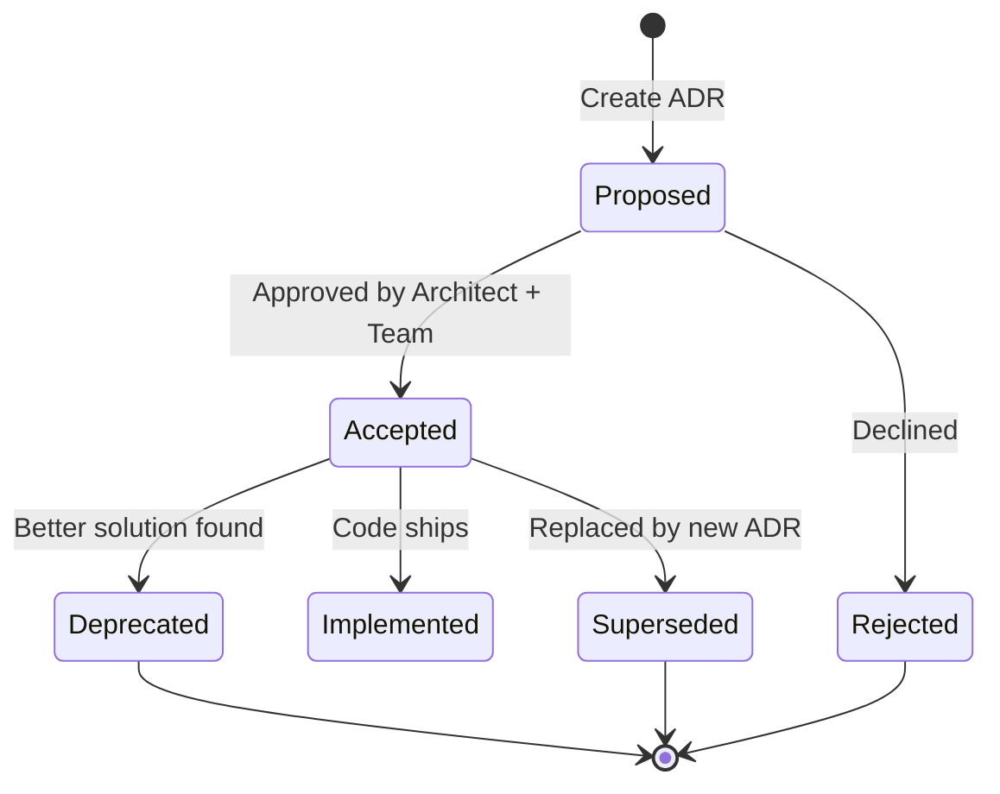

# Architecture Decision Records (ADRs)

This directory contains Architecture Decision Records for the Aria ticketing platform. ADRs document significant architectural decisions, their context, alternatives considered, and consequences.

## ADR Index

### Core Architecture

| ADR | Title | Status | Date | Tags |
|-----|-------|--------|------|------|
| [0001](./0001-use-expo-and-eas.md) | Use Expo + EAS for Mobile CI/CD | Accepted | 2024-11-18 | mobile, ci-cd |
| [0002](./0002-payment-orchestrator-abstraction.md) | Payment Orchestrator Abstraction Layer | Accepted | 2025-11-19 | architecture, backend, payments, mobile-money |
| [0003](./0003-monorepo-structure-platform-architecture.md) | Monorepo Structure and Platform Architecture | Accepted | 2025-11-19 | architecture, monorepo, backend, frontend, mobile |
| [0004](./0004-database-schema-migrations-strategy.md) | Database Schema and Migrations Strategy | Accepted | 2025-11-19 | architecture, backend, database, postgresql |
| [0005](./0005-state-machines-orders-payments-tickets.md) | State Machines for Orders, Payments, and Tickets | Accepted | 2025-11-19 | architecture, backend, domain-logic, state-management |
| [0006](./0006-multi-tenant-rbac-model.md) | Multi-Tenant RBAC Model | Accepted | 2025-11-19 | architecture, backend, security, authorization |

### Application Layer

| ADR | Title | Status | Date | Tags |
|-----|-------|--------|------|------|
| [0007](./0007-offline-first-checkin-pwa-architecture.md) | Offline-First Check-in PWA Architecture | Accepted | 2025-11-19 | architecture, frontend, pwa, offline |
| [0008](./0008-rest-api-design-standards.md) | REST API Design Standards | Accepted | 2025-11-19 | architecture, backend, api, conventions |
| [0009](./0009-authentication-session-management.md) | Authentication and Session Management | Accepted | 2025-11-19 | architecture, backend, security, authentication |

### Infrastructure

| ADR | Title | Status | Date | Tags |
|-----|-------|--------|------|------|
| [0010](./0010-deployment-architecture-environments.md) | Deployment Architecture and Environments | Accepted | 2025-11-19 | architecture, infra, deployment, devops |
| [0011](./0011-background-jobs-queue-architecture.md) | Background Jobs and Queue Architecture | Accepted | 2025-11-19 | architecture, backend, queues, jobs |
| [0012](./0012-observability-monitoring-stack.md) | Observability and Monitoring Stack | Accepted | 2025-11-19 | architecture, infra, observability, monitoring |

### Security & Compliance

| ADR | Title | Status | Date | Tags |
|-----|-------|--------|------|------|
| [0013](./0013-data-protection-privacy.md) | Data Protection and Privacy | Accepted | 2025-11-19 | architecture, security, privacy, compliance |
| [0014](./0014-payment-security-anti-fraud.md) | Payment Security and Anti-Fraud | Accepted | 2025-11-19 | architecture, security, payments, fraud |

## ADR Status Definitions

- **Proposed**: Under review, not yet implemented
- **Accepted**: Approved and ready for implementation
- **Deprecated**: No longer applicable, superseded by newer ADR
- **Superseded**: Replaced by a specific ADR (reference provided)

## How to Use This Index

### For Product Planners
- Review ADRs before creating new product specs to understand technical constraints
- Reference ADRs in product specs when features depend on architectural decisions

### For Implementers
- Read relevant ADRs before starting feature work
- ADRs provide implementation guidance, code examples, and testing strategies
- Challenge ADRs if implementation reveals flaws (propose new ADR to supersede)

### For Reviewers
- Verify PRs align with ADR recommendations
- Check that security ADRs (0013, 0014) are followed for sensitive features
- Ensure new features don't violate architectural boundaries defined in ADRs

### For QA
- ADRs define non-functional requirements (performance, security, offline behavior)
- Use ADRs to create test plans for infrastructure-level features

## Key Architectural Principles

Based on ADRs 0002-0014, Aria's architecture follows these principles:

1. **Separation of Concerns**: Payment logic abstracted (ADR-0002), state machines enforce domain rules (ADR-0005)
2. **Multi-Tenancy by Design**: Org-scoped RBAC prevents cross-tenant data leakage (ADR-0006)
3. **Offline-First for Critical Paths**: Check-in works offline with conflict-safe sync (ADR-0007)
4. **API Consistency**: REST standards applied uniformly (ADR-0008)
5. **Security in Depth**: Encryption, webhooks, anti-fraud, RBAC layered (ADR-0013, ADR-0014)
6. **Observability from Day One**: Metrics, logs, traces built-in (ADR-0012)

## Cross-Cutting Concerns Matrix

| Concern | ADRs | Key Decisions |
|---------|------|---------------|
| **Authentication** | 0009, 0013 | Laravel Sanctum tokens, 2FA via SMS OTP |
| **Authorization** | 0006 | Org-scoped RBAC, Laravel policies |
| **Payment Processing** | 0002, 0014 | Provider abstraction, webhook security, idempotency |
| **Data Storage** | 0004, 0013 | PostgreSQL 16, PII encryption, partitioning strategy |
| **State Management** | 0005 | Spatie state machines, audit logging, optimistic locking |
| **Offline Capability** | 0007 | Service Worker, IndexedDB, HMAC ticket verification |
| **API Design** | 0008 | JSON envelope, cursor pagination, idempotency headers |
| **Background Jobs** | 0011 | Redis queues, Laravel Horizon, priority tiers |
| **Deployment** | 0010 | Fly.io/DigitalOcean, managed PostgreSQL, Cloudflare CDN |
| **Monitoring** | 0012 | Sentry errors, Prometheus metrics, OpenTelemetry traces |

## Relationship to Product Specs

All ADRs are aligned with [aria-mvp.md](../product_specs/aria-mvp.md) and the comprehensive [DESIGN.md](../../context/DESIGN.md).

### ADRs Addressing Product Requirements

- **User Story 1 (Attendee mobile-money checkout)**: ADR-0002, ADR-0008
- **User Story 2 (Organizer event management)**: ADR-0003, ADR-0006
- **User Story 3 (Offline check-in)**: ADR-0007
- **User Story 4 (Platform admin payouts)**: ADR-0006, ADR-0014
- **User Story 5 (Payment processing)**: ADR-0002, ADR-0005, ADR-0014

### Non-Functional Requirements

- **Performance (<200ms P95)**: ADR-0004 (indexing), ADR-0010 (regional deployment)
- **Security (OWASP ASVS L2)**: ADR-0013, ADR-0014
- **Availability (99.9%)**: ADR-0010, ADR-0012
- **Offline-first**: ADR-0007

## Contributing New ADRs

When proposing a new ADR:

1. **Check existing ADRs**: Avoid duplicating decisions
2. **Use the template**: Follow ADR-0002 structure (Context, Drivers, Options, Outcome, Consequences)
3. **Number sequentially**: Next ADR is 0015
4. **Reference DESIGN.md**: Cite relevant sections
5. **Update this README**: Add entry to index table
6. **Request review**: Architect and at least one implementer must approve

## ADR Lifecycle

## References

- **DESIGN.md**: [/Users/claude-micaelguinan/aria/context/DESIGN.md](../../context/DESIGN.md)
- **Product Spec**: [aria-mvp.md](../product_specs/aria-mvp.md)
- **GitHub Issue #1**: [Design payment orchestrator abstraction layer](https://github.com/user/aria/issues/1)
- **ADR Best Practices**: [https://adr.github.io/](https://adr.github.io/)
